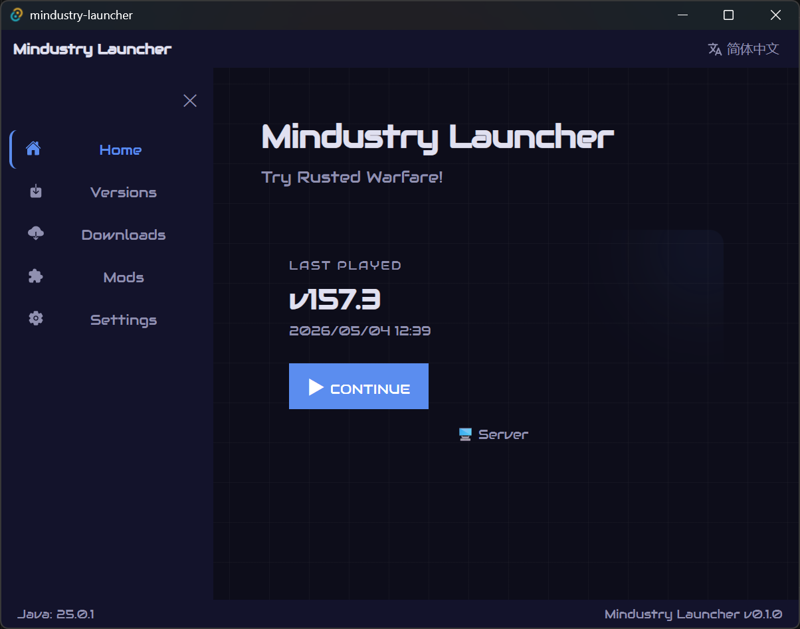
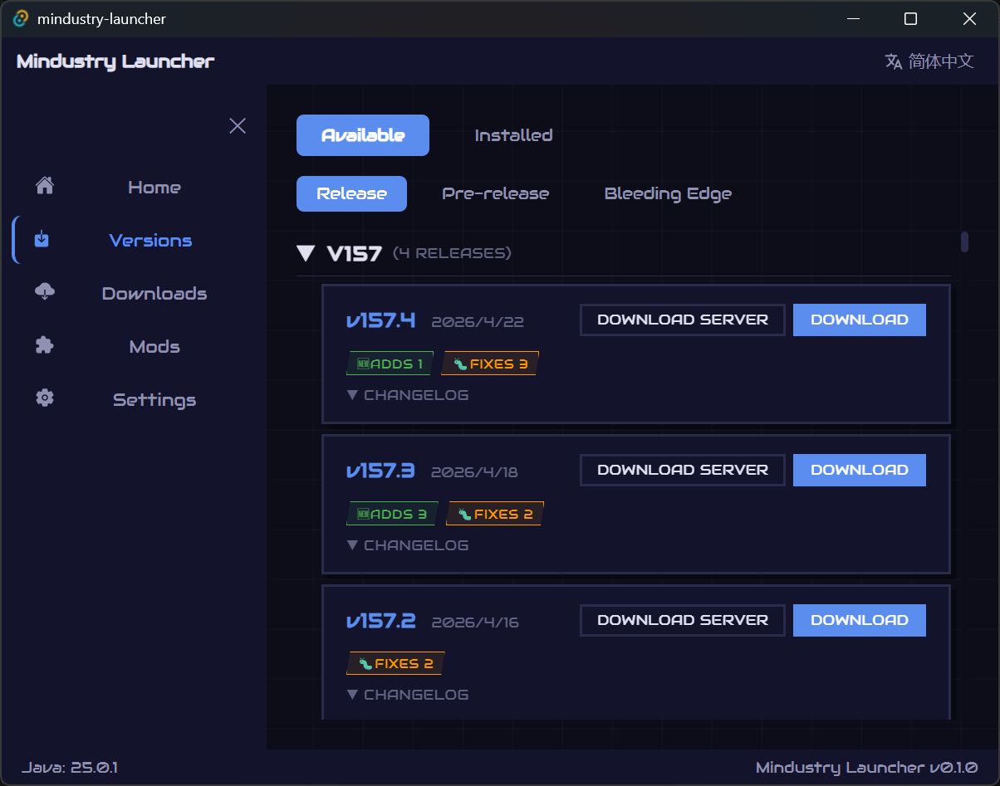
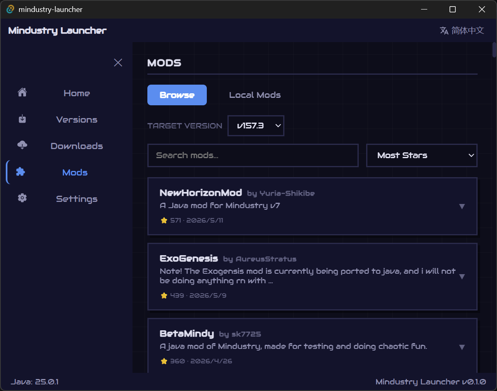
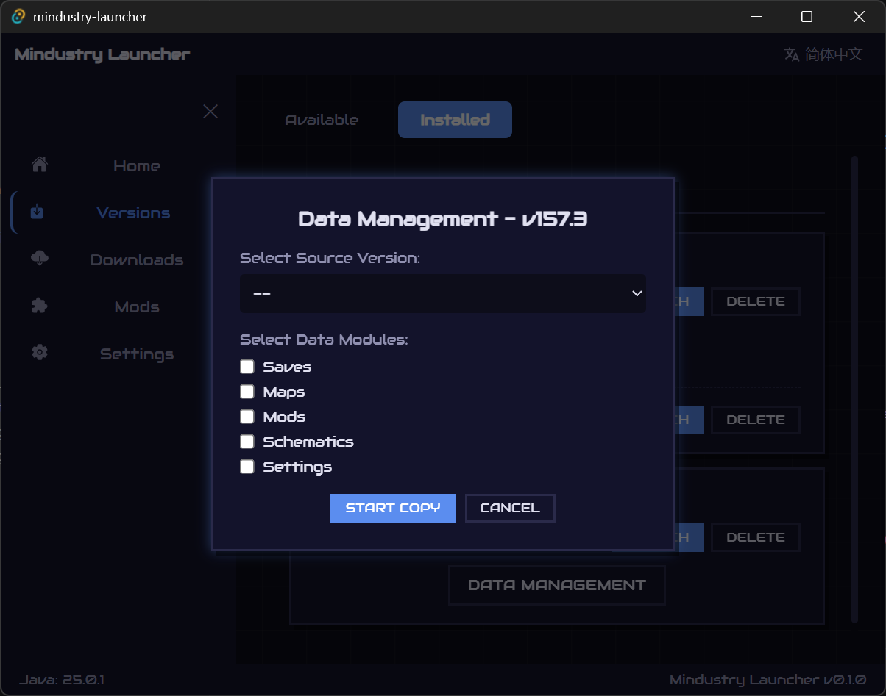
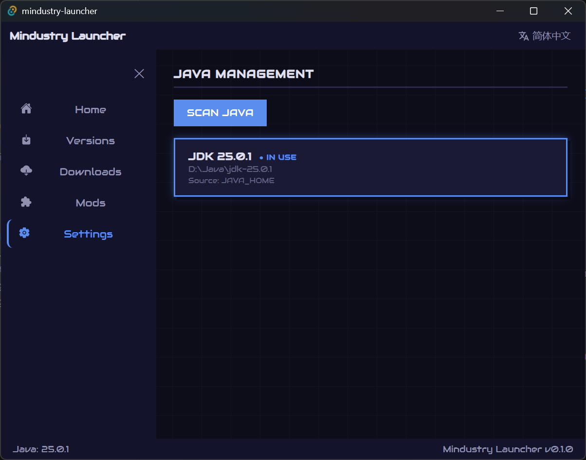

<h1 align="center">
  <br>
  Mindustry Launcher
</h1>

<p align="center">
  <a href="https://github.com/Walker196/Mindustry-Launcher/releases/latest">
    
  </a>
  <a href="https://github.com/Walker196/Mindustry-Launcher/blob/main/LICENSE">
    
  </a>
</p>

<p align="center">
  <b>A sleek desktop launcher for Mindustry — manage versions, mods, and Java runtimes with a futuristic UI.</b><br>
  一个为 <b>Mindustry</b> 精心打造的桌面启动器，基于 <b>Tauri + React + Rust</b>。
</p>

---

## ✨ Features 功能

- 📦 **Version Management**  
  Browse & download official releases, pre‑releases, and Bleeding Edge builds.  
  **版本管理**：浏览并下载正式版、预发布版、Bleeding Edge 构建。
- ☕ **Java Auto‑detection**  
  Automatically find installed JDKs or select a custom one manually.  
  **Java 自动检测**：扫描已安装的 JDK，也可手动指定。
- 🧩 **Mod Browser**  
  Explore community mods by stars or recency, one‑click install into any game version.  
  **模组浏览器**：按星标或时间排序，一键安装到对应游戏版本。
- 🔄 **Data Migration**  
  Copy saves, maps, mods, schematics, and settings between versions.  
  **数据迁移**：跨版本复制存档、地图、模组、蓝图和设置。
- 🌐 **i18n**  
  Full Chinese & English support.  
  **国际化**：完备的中文和英文界面。
- 🎨 **Industrial Sci‑fi UI**  
  Angled cards, glow effects, responsive animations.  
  **工业科幻风界面**：硬朗切边卡片、发光特效、流畅动画。

---

## 📸 Screenshots 截图

| Home 首页 | Versions 版本库 |
|-----------|----------------|
|  |  |

| Installed 已安装 | Mod Browser 模组 |
|------------------|-------------------|
|  |  |

| Data Migration 数据迁移 | Settings 设置 |
|-------------------------|--------------|
|  |  |

*Screenshots are from the English UI. Chinese screenshots can be added similarly.*

### ⚡ Preloaded Cache (Optional) 预置缓存（可选）

如果你希望启动器**首次启动就能立刻显示版本和模组列表**（无需等待网络加载），可以手动下载预置缓存文件。
To make the launcher show version and mod lists **immediately on first launch** (without waiting for network requests), you can manually download preloaded cache files.

1. 从本仓库的 [`cache/`](cache/) 目录下载三个 `.json` 文件。
1. Download the three `.json` files from the [`cache/`](cache/) folder in this repository.
2. 将它们放入启动器安装目录下的 `Data/` 文件夹（与 `Mindustry Launcher.exe` 同级）。
2. Place them in the `Data/` folder inside the launcher's installation directory (same folder as `Mindustry Launcher.exe`).
3. 重启启动器后即可离线浏览。
3. Restart the launcher—all lists will be available offline.

> 启动器联网时也会自动更新这些缓存，日常使用中无需再次手动操作。
> The launcher automatically refreshes these caches when connected to the internet, so you normally don't need to do this again.

---

## 🛠️ Tech Stack 技术栈

| 层 | 技术 |
|----|------|
| Frontend 前端 | React 18, TypeScript, Framer Motion |
| Backend 后端 | Rust (Tauri 2), Reqwest, Tokio |
| Build 构建 | Vite, pnpm |

---

## 🚀 Quick Start 快速开始

### Prerequisites 前置
- [Node.js](https://nodejs.org/) >= 18
- [pnpm](https://pnpm.io/)
- [Rust](https://www.rust-lang.org/)
- [Tauri CLI](https://tauri.app/) (自动安装)

## 🙏 Credits 致谢

- [Anuken/Mindustry](https://github.com/Anuken/Mindustry) — The game that started it all.
- Icon from the *Animdustry* April Fools event (2022).
- All [contributors](../../graphs/contributors) who helped improve this launcher.
- The amazing Rust, React, and Tauri communities.

### Development 开发
```bash
pnpm install
pnpm tauri dev
pnpm tauri build
